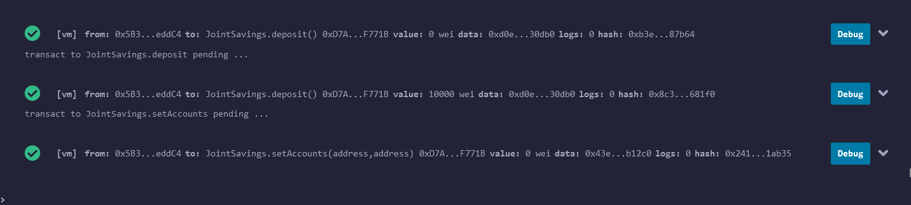
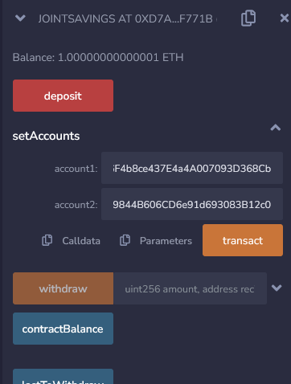
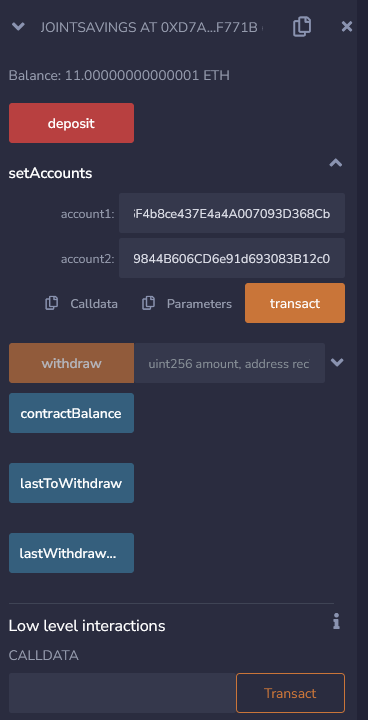
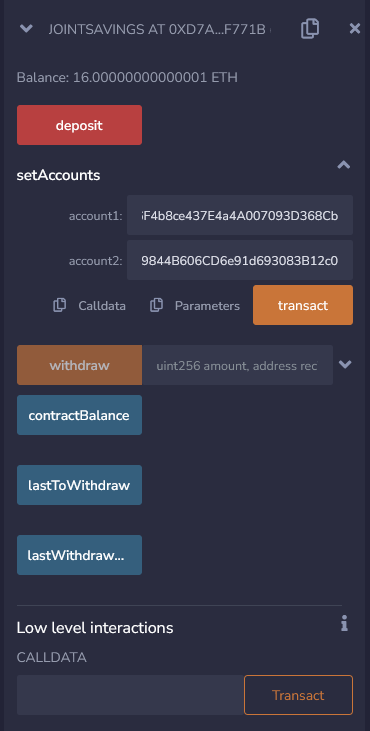
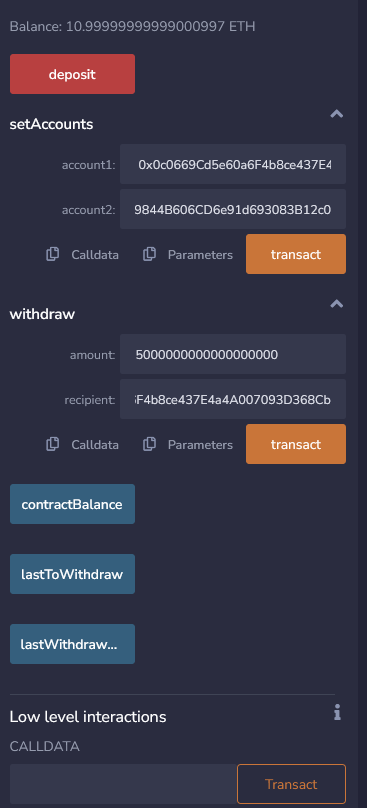
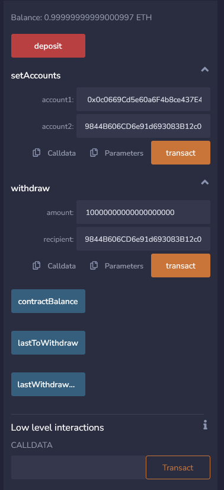
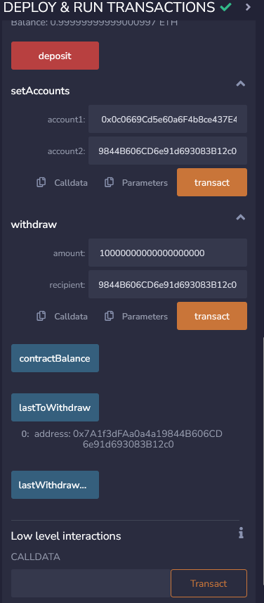
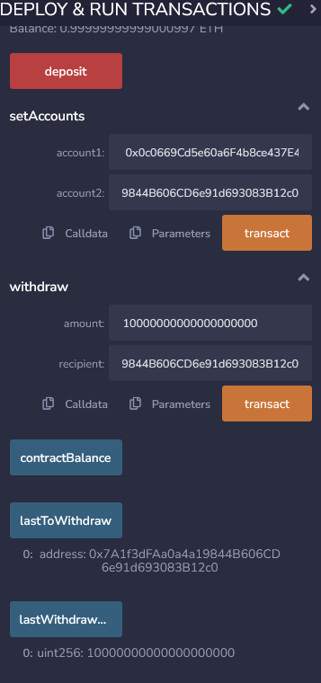

# Challenge XX | Fintech 
---
This project is the twenty challenge in the Columbia Fintech Bootcamp.

This challenge deals with Ethereum Blockchain contracts using Solidity

This code implements a Solidity Contract that simulates a Join Savings Account

---

## Solidity

Solidity is a programming language specialized in working with the Ethereum blockchain to create Smart Contracts, it is a typed and compiled language based on Object Oriented Programming

To program, a web IDE is used, Remix: [REMIX](https://remix.ethereum.org/)


### Contract Deployment

Contract is deployed to the Ethereum network.


After deploying the contract, the functionality is tested:

The functions include:

* Deposit - Deposits ETH from an specific ETH address
* Set Accounts - Sets two joint accounts addresses
* Withdraw - Moves money from the contract to one of the allowed accounts
* Contract Balance - Displays the current contract balance
* Last To withdraw - Last address to withdraw
* Last Withdraw address - Last Withdraw amount

### Testing the functions.

* setAccounts - Setting internal savings accounts.



* Deposit - Deposit ETH to the contract

    * Deposit 1 ETH 
    

    * Deposit 10 ETH 
    
    * Deposit 5 ETH 
    

* Withdraw - Withdraws from contact into one of the two savings accounts
    * Withdraw 5 ETH into accountOne
    

    *Withdraw 10 ETH into accountTwo
    

* Last To Withdraw




* Last Withdraw Amount



### Transaction List

The whole list of transactions is in the following file:

[Transaction File](./transactions.json)

---

## Technologies

The main language is Solidity in the Remix Ethereum IDE environment
The language version is 0.5 or more.


---

### Run program

To run the Smart Contrat, go to [REMIX](https://remix.ethereum.org/#lang=en&optimize=false&runs=200&evmVersion=null)

Copy or upload the **join_savings.sol** file. Compile and deploy to a Test Ethereum Network

### Clone repository
```bash
git clone https://github.com/lumiroga/fintech-challenge20.git
```
---


---

## Contributors

[lumiroga](https://github.com/lumiroga)

---

## License

* apache-2.0 | Apache License 2.0
